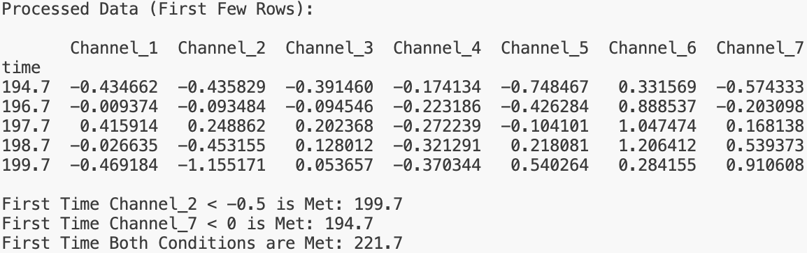
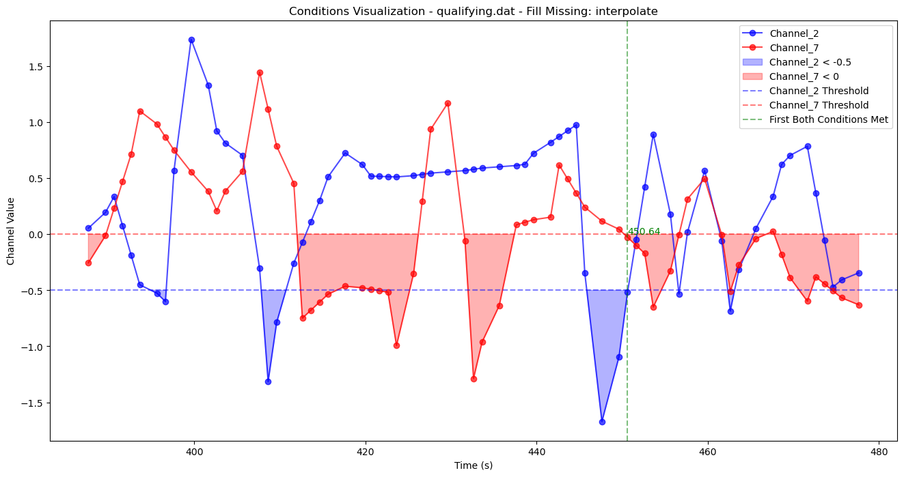

# Aero Performance Software Assignment

**Author**: Michael Song (ms423@ic.ac.uk)

## Project Overview

This project processes race car data from pressure sensors and analyzes it for specific conditions. The data contains multiple channels recorded at different times, and the software calculates missing channels, fills missing values if required, and detects specific conditions within the data.

### Channel Definitions

- **Channels 1 to 6**: Recorded data from the race car's sensors.
- **Channel 7**: Calculated as `Channel_7 = Channel_5 - Channel_4`.

### Conditions for Analysis

1. `Channel_2 < -0.5`
2. `Channel_7 < 0`
3. Both conditions met simultaneously.

## Features

- **Data Processing**: Reads, reshapes, and processes the input data.
- **Condition Detection**: Finds the first time each condition is met.
- **Missing Data Handling**: Optionally fill missing values using methods like interpolation, forward fill, or backward fill.
- **Visualization**: Plots Channel 2 and Channel 7, highlighting the times when conditions are satisfied.

## Notes on Input Data

- It should have the same format as the provided data files.
- It can have more than 6 channel numbers.
- The rows does not need to be sorted by time.
- It should contains at least one time-value pair for channel 2, 4, and 5.
- Channel 7 is reserved for the difference between channel 5 and channel 4, any values in channel 7 will be overwritten.

## Requirements

- Python 3.x
- Libraries:
  - `pandas`
  - `matplotlib`
  - `argparse`
  - `math`

You can install the required libraries via `pip`:

```bash
pip install pandas matplotlib
```

## Usage

### Command-Line Arguments

- `-i` / `--input`: Path to the input data file (required).
- `-f` / `--fill`: Optional flag to fill missing values.
- `-m` / `--method`: Method to fill missing values. Options: **interpolate**, **ffill**, **bfill** (default: interpolate).

### Running the Code

To run the program, execute the following:

```bash
python main.py -i <path_to_data_file> [-f] [-m <fill_method>]
```

- Example without filling missing values:

```bash
python main.py -i practice.dat
```

- Example with filling missing values using interpolation:

```bash
python main.py -i practice.dat -f
```

- Example with filling missing values using forward fill:

```bash
python main.py -i practice.dat -f -m ffill
```

### Sample Output

The processed data and condition results will be printed to the console. For example:



### Generated Plot

A plot visualizing the data and conditions will be saved to the `plots/` directory. For example:



## Results

Results for `practice.dat` with different missing data handling methods:

|   | Original | Interpolate | Forward Fill | Backward Fill |
|---|----------|-------------|--------------|---------------|
| `Channel_2 < -0.5` | 200.7 | 199.7 | 200.7 | 198.7 |
| `Channel_7 < 0` | 194.7 | 194.7 | 194.7 | 194.7 |
| **Both Conditions** | nan | 221.7 | 221.7 | 215.7 |

Results for `qualifying.dat` with different missing data handling methods:

|   | Original | Interpolate | Forward Fill | Backward Fill |
|---|----------|-------------|--------------|---------------|
| `Channel_2 < -0.5` | 396.64 | 395.64 | 396.64 | 395.64 |
| `Channel_7 < 0` | 387.64 | 387.64 | 387.64 | 387.64 |
| **Both Conditions** | nan | 450.64 | 456.64 | 408.64 |

## Other Tests

We provided two additional data file in `tests/` to test whether the solution can handle more cases:

- `test1.dat`: This file is a shuffled version of `practice.dat`. The solution is able to handle shuffled data rows, and the result is the same as `practice.dat`.
- `test2.dat`: This file extends the data in `qualifying.dat` with additional channels. The solution is able to handle additional channels, and the result is the same as `qualifying.dat`.